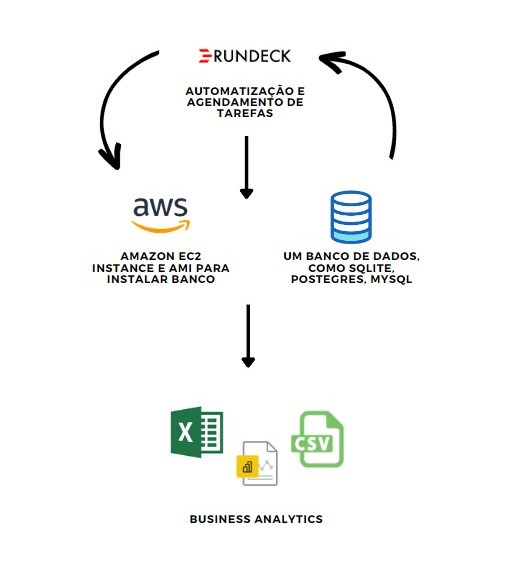

# Introduction

At my second internship I had a blessed opportunity to work with a lot of cool features and begin my experience with data pipelines and also to understand some aspects of data engineering. For the majority of the time, I worked using python scripts for job scheduling and SQL queries for the ETL process.

I’m not going to be able to show all the aspects of this internship because there were some different levels of it, like the Agile culture and its Rites. I had my peers Devs, a product owner to which I reported my tasks progresses daily, an agile coach responsible for the team productivity and a Tech Lead making sure everyone understands the business and technicalities of our projects.

My aim with this project is to emulate the business intelligence culture of Extract Data, Transform it and Load it into a database. From there we should be able to access tables using a dbms or connect to the database using other tools or languages.

So we will need:

·         a script for download the data

·         a script for insert the data into a database

·         a batch file to execute both scripts

·         a scheduler for automation

·         connect into the database using a bi visualization tool


## BI Project Design



| E  | Ação |
| ------------- | ------------- |
| 1  | Construir o Banco Local |
| 2 | Configurar Amazon EC2  |
| 3 | Installar banco no AMI  |
| 4 | Configurar Rundeck  |
| 5 | Criar Job para Zazer Download de Dados  |
| 5 | Criar Job para Acessar dados  | 
| 5 | Criar Job para Fazer as Transformações |
| 5 | Criar Job para Fazer as Transformações |
| 5 | Criar Job para inserir no banco |
| 6 | Configurar ODBC para conectar Powerbi com Banco |
| 7 | Acessar Banco com o Power Bi |
| 8 | Criar Painel |

The dream scenario would be to have a EC2 instance and inside it creating an AMI where we would install our

database. For that, we would use this guide provided by amazon.


I already have an instance, so the next step would be to follow this guide:
Link
```
‘https://docs.aws.amazon.com/elasticbeanstalk/latest/dg/using-features.customenv.html’
```
 

With a database installed we would be able to access it using a server-based database, like postgres and use it to

insert and retrieve data.

## Database Schema


Now, keep in mind that all this table come from the same place, the first table, SATRA, is the main table and from its values we can filter data from “Transmissão” and from that we can aggregate them into the last table, “Indisponibilidade”. We could easily retrieve the table 2 and 3 from the first one just by writing a query. But it can be useful from the business standards point to have all three of them, in the sense that you could have a simple way to relate Different areas with “Transmisão”, or even find the non-aggregated value of table 3 related to itself.

## Scripts

For this step we would need 3 scripts (or just one with 3 steps on it), one to download the base, one to transform it and one to load it on the database.

Example:
```
conn = sqlite3.connect('bd_indisponibilidade')
c = conn.cursor()

c.execute('CREATE TABLE IF NOT EXISTS tabela_ind (Agente text, Contrato text, IdAgente number, Ano number, Ruracaoo_Real_Minutos number)')
conn.commit()

df = df_indisponibilidade

df.to_sql('tabela_ind', conn, if_exists='replace', index = False)
conn.commit()
```


As you can see, our data was successfully inserted on our db.

## Automating Everything

Rundeck Configuration

Example:

```
https://docs.rundeck.com/docs/administration/configuration/config-file-reference.html#server-settings
```

## Power Bi Visualization

```
SELECT Empresa, IdAgente, Ano, Duracao_Real_Minutos as "Interrupção (Horas)"
  FROM INDISPONIBILIDADE
  WHERE AREA_ATUACAO = 'Transmissao'
```


